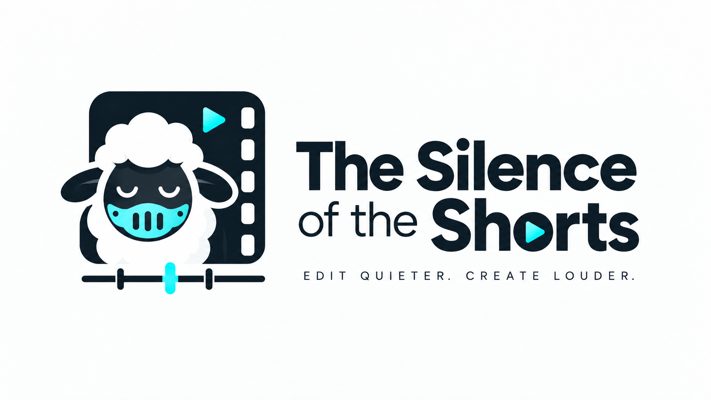

<p align="center"></p>

<p align="center"><a href="README.md">English</a> · <b>Español</b></p>

# The Silence of the Shorts

App de escritorio para Mac que deja un vídeo hablado listo para publicar:
limpia el ruido de la voz, recorta los silencios, quema subtítulos estilo
Reels y genera título, caption y hashtags con un modelo de IA local. Todo
en tu Mac, sin subir nada a ningún servicio.

| Entrada | Salida |
|---|---|
| `charla.mov` (cualquier vídeo con voz) | `charla_limpio.mp4` (voz limpia, sin silencios, subtítulos opcionales) |
| | `charla_limpio.srt` (subtítulos, si los activas) |
| | `charla_limpio.md` (título SEO, caption y hashtags, si lo activas) |

## Requisitos

- Mac con **Apple Silicon** (M1, M2, M3, M4…). Los Mac Intel no están soportados.
- **macOS 13** Ventura o posterior.
- **10 GB libres** en disco: entorno Python (2,5 GB), modelos de audio
  (0,7 GB) y, si quieres el caption SEO, el modelo de lenguaje (6 GB).
- Conexión a internet durante la instalación (descargas) y la primera vez
  que uses subtítulos. Después funciona sin conexión.
- Memoria: 16 GB es suficiente para todo salvo modelos de lenguaje grandes;
  la app te avisa de cuáles caben en tu Mac.

El instalador se ocupa de Homebrew, Python, ffmpeg, auto-editor y Ollama.
No hace falta saber programar.

## Instalación

1. Descarga el proyecto desde la rama **`main`**, que es la versión
   estable (botón **Code → Download ZIP** en GitHub, la última entrada en
   **Releases**, o `git clone -b main …`) y descomprímelo donde quieras
   dejarlo, por ejemplo en `~/Documents`. La rama `develop` es trabajo en
   curso y puede no funcionar. **No muevas la carpeta después de
   instalar**; si lo haces, vuelve a ejecutar el instalador.
2. Doble clic en **`instalar.command`**. Si macOS dice que no se puede
   abrir porque es de un desarrollador no identificado: clic derecho →
   **Abrir** → **Abrir**. Se abre una ventana de Terminal.
3. Sigue lo que diga la Terminal. Pedirá tu contraseña una o dos veces
   (para Homebrew) y tardará entre 10 y 30 minutos según tu conexión.
   Cuando termine verás **Instalación completa**.

Al acabar tendrás el icono 🎬 **The Silence of the Shorts** en el Dock.

Si algo falla a mitad, vuelve a ejecutar `instalar.command`: retoma donde
lo dejó. Para desinstalar: `desinstalar.command`.

Variantes:

```bash
SIN_OLLAMA=1 ./instalar.command   # sin caption SEO (ahorra 6 GB)
SIN_DOCK=1 ./instalar.command     # sin icono en el Dock
```

## Primer arranque

- La app sigue el idioma del Mac (español o inglés). Puedes forzarlo con
  el selector 🌐 de abajo; pide confirmación y se reinicia (cancela
  cualquier proceso en marcha).
- macOS preguntará si la app puede acceder a **Documentos** (o a la
  carpeta donde tengas los vídeos). Acepta; si no, no podrá leerlos. Si
  lo negaste: Ajustes del Sistema → Privacidad y seguridad → Archivos y
  carpetas → The Silence of the Shorts.
- La primera vez que actives subtítulos o el caption descarga el modelo
  Whisper (~1,6 GB con turbo, el recomendado). Solo esa vez.

## Cómo funciona

1. **Arrastra** uno o varios vídeos a la zona de la izquierda (o haz clic
   para elegirlos). Aparecen en la cola.
2. **Elige opciones** a la derecha:
   - **Modo**: pipeline completo (limpiar + recortar), solo limpiar audio,
     o solo cortar silencios.
   - **Limpieza de audio**: modelo de IA para quitar ruido. El de defecto
     (MossFormer2 48 kHz) es el mejor para voz.
   - **Corte de silencios**: margen que se deja alrededor de cada frase y
     umbral de volumen. "Acelerar" en vez de cortar los silencios los
     reproduce a la velocidad que indiques.
   - **Subtítulos**: diseño (8 a elegir: Reels bold, karaoke, karaoke
     verde, Impacto, amarillo, minimalista, caja negra y caja blanca),
     posición, tamaño, idioma y tamaño del modelo Whisper. La previsualización te
     enseña cómo quedan sobre un fotograma real del vídeo seleccionado.
   - **Caption SEO**: genera `nombre_limpio.md` con título, caption y
     los 5 hashtags que mejor describen lo que se dice en el vídeo. **Marca…** guarda un
     texto con quién eres, tu tono y tu llamada a la acción para que el
     texto suene a ti. **Modelo** lista los modelos de Ollama instalados en
     tu Mac; los que no caben en memoria aparecen deshabilitados y el
     tooltip dice por qué.
   - **Términos…**: tus marcas y nombres propios, uno por línea, para que
     Whisper los escriba bien en los subtítulos y el caption. Después de
     `=`, las formas en que Whisper se equivoca; se corrigen solas:

     ```
     Claude Code = Cloud Code, Claus Code
     Anthropic
     ```
3. **Salida**: por defecto junto al original como `nombre_limpio.mp4`;
   con **Cambiar…** eliges otra carpeta.
4. **▶ Procesar**. La cola avanza de uno en uno mostrando el paso
   (extrayendo audio, limpiando, recortando, transcribiendo…). Tarda
   aproximadamente lo que dura el vídeo. Mientras la app esté abierta el
   Mac no entra en reposo.
5. Al terminar, **doble clic** en un vídeo hecho lo abre. Si generaste
   caption, aparece debajo de la previsualización con botones para copiar
   título, caption, hashtags o todo.

Puedes seguir usando el Mac mientras procesa. Bloquear la pantalla no
detiene nada; cerrar la tapa sin monitor externo sí.

### Desde la terminal

```bash
./TheSilenceOfTheShorts.command                              # la misma app
.venv-clearvoice/bin/python limpiarVideo.py video.mov        # sin interfaz
.venv-clearvoice/bin/python limpiarVideo.py video.mov --caption --marca "Soy…"
```

## Si algo va mal

- Una fila en **rojo** en la cola es un vídeo que ha fallado. **Doble clic**
  sobre ella: verás la causa, qué hacer y un botón **Abrir log** con todo
  el detalle. Los logs están en `logs/`.
- Una fila con **⚠** ha terminado, pero con un aviso (por ejemplo, los
  subtítulos o el caption fallaron y el vídeo se guardó sin ellos). Pasa
  el ratón por encima para leerlo.
- "**Faltan dependencias**" al abrir: vuelve a ejecutar `instalar.command`.
- El **caption** no se genera: comprueba que la app de Ollama esté abierta
  (icono en la barra de menú) y pulsa ↻ junto al selector de modelo. Para
  añadir modelos: `ollama pull nombre` en Terminal y luego ↻.
- Tras actualizar Homebrew (Python) la app se reconstruye sola al
  arrancar (tarda unos segundos más esa vez). Si aun así no abre, ejecuta
  `instalar.command` de nuevo.

## Qué usa por dentro

[ClearVoice](https://github.com/modelscope/ClearerVoice-Studio) (limpieza de
voz, Apache-2.0), [auto-editor](https://auto-editor.com) (silencios),
[mlx-whisper](https://github.com/ml-explore/mlx-examples/tree/main/whisper)
(transcripción con la GPU del Mac; faster-whisper en macOS 13),
ffmpeg (vídeo), [Ollama](https://ollama.com) (modelo de lenguaje local),
PySide6 (interfaz). Documentación técnica en `docs/DEVELOPMENT.md` (en inglés).

Licencia: Apache-2.0 (ver `LICENSE`). Incluye código de ClearerVoice-Studio,
© Alibaba, bajo la misma licencia.
